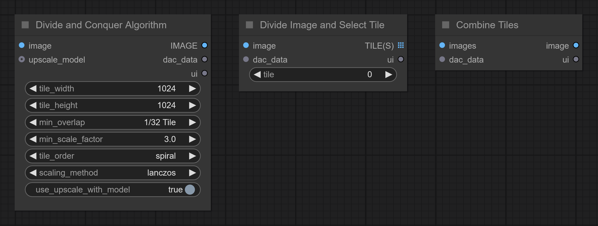
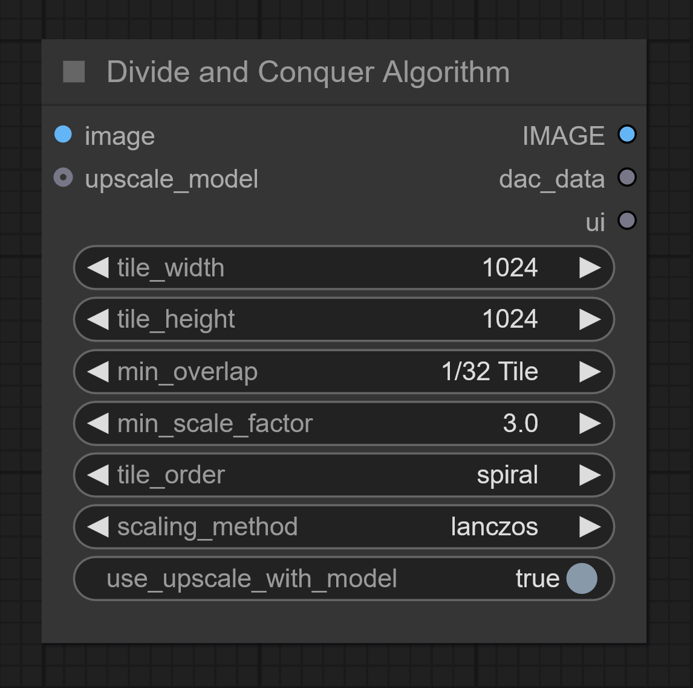
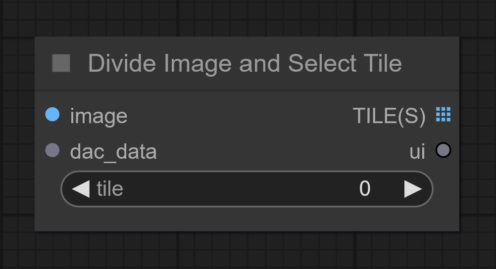
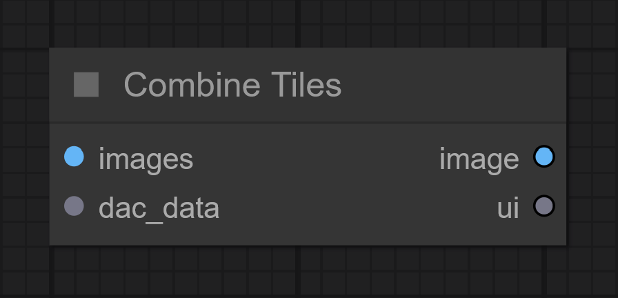

# **ComfyUI [**Steudio**](https://linktr.ee/steudio)**

# Divide and Conquer Node Suite 2.0.0

:pushpin: If you're updating from version 1.x.x, make sure to replace the old nodes with the new ones in your workflow to avoid potential errors.

# Intro

A suite of nodes designed to enhance image upscaling. It calculates the optimal upscale resolution and divides the image into tiles, ready for individual processing using your preferred workflow. After processing, the tiles are seamlessly merged into a larger image, offering sharper and more detailed visuals.

## 1. Divide and Conquer Algorithm | Node

Taking into account tile dimensions, tile overlap, and the minimum scale factor, the node upscales the image to optimal dimensions, avoiding the creation of unnecessary tiles. 

### Inputs / Outputs
**`::image`**:
The image you want to upscale. 
**`::upscale_model`(optional)**:
To use with Comfy Core node **UpscaleModelLoader**. 
**`IMAGE::`**:
Optimized image dimensions to connect to **Divide Image and Select Tile**. 
**`dac_data:`**:
Data to pass along to following nodes: **Divide Image and Select Tile** and **Combine Tiles**. 
**`ui:`**
Image processing algorithm summary. 

### Parameters

**`tile_width`**: This parameter specifies the width of each tile that the image will be divided into.*The default value is 1024 pixels.* 
**`tile_height`**: This parameter specifies the height of each tile that the image will be divided into.The default value is 1024 pixels. 
**`min_overlap`**: This parameter specifies the minimum amount of overlap between adjacent tiles to help blend the tiles seamlessly when they are combined back together. *The default value is '1/32 Tile', and it can range from "None" to "1/2 tile".* 
**`min_scale_factor`**: This parameter determines the minimal scale factor. The effective scale factor will be determined by the tile dimensions and tile overlap. *The default value is 3, and it can range from 1.0 to 8.0* 
**`tile_order`**: This parameter specifies the order in which the tiles are processed. It can be either 'linear' or 'spiral'. 'Linear' processes the tiles in a row-by-row manner, while 'spiral' processes them in an outward clockwise spiral pattern ending at the center. *The default value is "spiral".* 

 
**`Scaling_method`** The image will go through a process to meet the optimal upscaled dimensions. *The default value is lanczos.* 
**`use_upscale_with_model`(optional)**: True/false switch to enable the feature.
Bypassed if `::upscale_model` is not connected. *The default value is true.* 

## 2. Divide Image and Select Tile | Node
Taking into account tile dimensions, tile overlap, and final image dimensions, the node calculates coordinates and divides the image into tiles.

### Inputs / Outputs
**`::image`**
The image you want to upscale. 
**`::dac_data`**
Connect from the dac_data output of the "Divide and Conquer Algorithm" node. 
**`TILE(S)::`**
All tiles (0) or specific tile (#) to path through (#). 
**`ui::`**
Matrix visualization. 

### Parameters
**`position`**:
Select the tile(s) to path through. Position (0) indicates all the tiles, while Position (#) specifies an individual tile. 

## 3. Combine Tiles | Node
Combines the processed tiles back into a single image, applying a **Gaussian blur mask** on the overlapping pixels to ensure smooth transitions between the overlapping tiles. 

### Inputs / Outputs

**`::images`**
The tiles you want to combine into one upscaled image. 
**`::dac_data`**
Connect from the dac_data output of the "Divide and Conquer Algorithm" node. 
**`image::`**
The combined image, made of multiple tiles. 
**`ui::`**
Matrix visualization. 

## Workflow example
Get the workflow directly from ComfyUI menu: 
Workflow > Browse Templates > comfyui_steudio

:grey_exclamation: This workflow uses the following optional nodes: 
[Set/Get](https://github.com/kijai/ComfyUI-KJNodes) | 
[Image Comparer](https://github.com/rgthree/rgthree-comfy) | 
[Fast Groups Bypasser](https://github.com/rgthree/rgthree-comfy) |
[ComfyUI-Florence2](https://github.com/kijai/ComfyUI-Florence2) |
[TeaCache](https://github.com/welltop-cn/ComfyUI-TeaCache)

## Video Tutorial
Coming Soon!

:100: cropped comparison. 
 

[Full image with more details generated](https://imgsli.com/Mzc2MzA3) The image has been upscaled 2×, three times.

[Full image with less details generated ](https://imgsli.com/Mzc2OTMx) The image has been upscaled 2×, three times.

## TIPS
- General upscaling guidelines do apply, but the **Divide and Conquer Node Suite** offers better control per tile, enabling higher detail transfer.
- Instead of generating the entire set of tiles, a single tile can be generated as a test sample to verify your img2img parameters.
- Ensure that the input folder only contains the tiles you intend to combine.
- If seams appear in the combine image, increase the overlap.

# Installation
Install via ComfyUI-Manager or Clone this repo into `custom_modules`:

# Changelog
`Version 2.0.0` (2025-05-04) 
- Improved user experience.
- Scaling using model is now optional.
- Can generate all tiles or a single tile without fiddling with the links.

`Version 1.2.1` (2025-02-10) 
- No more abnormally large upscales.
- Given the right conditions, it is now possible to tile the image without upscaling it.
  
`Version 1.1.0` (2025-01-05) 
- Nodes now process images as a list instead of a batch, enabling the execution of divide and combine operations in one go.
- Improved Gaussian blur for blending masks.
- Minor fixes.

`Version 1.0.0` (2024-12-01) Initial public release.

# Acknowledgements
This repository utilizes code from: 
[ComfyUI](https://github.com/comfyanonymous/ComfyUI/) | [Comfyroll Studio](https://github.com/Suzie1/ComfyUI_Comfyroll_CustomNodes) | [SimpleTiles](https://github.com/kinfolk0117/ComfyUI_SimpleTiles) | [KJNodes](https://github.com/kijai/ComfyUI-KJNodes) | [RGThree](https://github.com/rgthree/rgthree-comfy) | [Cubiq](https://github.com/cubiq/ComfyUI_essentials) | [Pythongosssss](https://github.com/pythongosssss/) 

# License
GNU GENERAL PUBLIC LICENSE Version 3, see [LICENSE](LICENSE)

# Thank you
Copyright (c) 2025, Steudio - https://github.com/steudio

